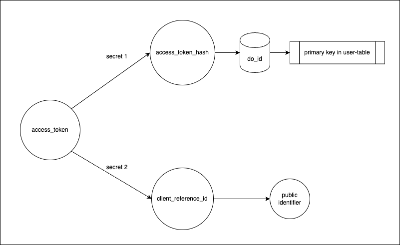

# Encryp secret rotation

problem 1 (RESOLVED): we might loose the original DB_SECRET or might be required to rotate it incase it gets compromised

It's used to generate `client_reference_id` from provided `access_token` and to re-retrieve the access_token based on client_reference_id. Since the DB_SECRET must be able to be rotated, the client_reference_id is always regenerated based on access token. The time it lives in stripe is very short, as long as the stripe session lasts, so it may end up in a few failed payments when rotating the secret.

This is solved now by keeping the access_token as the only source of truth for the `client_reference_id` and updating it when it is not the same anymore.

# Access tokens in db

Problem 2: we don't want to use `access_tokens` as names or store them into the db directly (users table primary key is now `access_token`). instead, we should have another secret (or the same, twice) and store the encrypted value as `access_token_hash` and use that as the primary key, instead.

# Login by payment

Goal is to identify buyers after a payment link payment (without them being logged in). My Learnings:

- payment links don't provide customer ids that identify the customer. even if enabled to gather customer_id (`customer_creation:always`) they are re-created for every new payment, so this isn't useful.
- we can verify the user using `payment_method_details.card.fingerprint` (https://docs.stripe.com/api/charges/object#charge_object-payment_method_details-card-fingerprint) for `card` payments and using `customer_details.email` for `link` payments. More info: https://docs.stripe.com/api/charges/object#charge_object-payment_method_details.
- Apple Pay, Google Pay, and direct credit cards all probably provide `card` information. Potentially way more ( see: https://docs.stripe.com/api/charges/object#charge_object-payment_method_details-card-wallet-type)

TODO:

- ✅ create new version with `verified_user_access_token` column on users
- ✅ if payment is done from access token that has no user yet, create user with 0, and set column `verified_user_access_token`. balance should to to user with that `access_token` instead.
- ✅ in `handleUserSession` when found user has `verified_user_access_token`, change `access_token` to there.

🎉 Now I can login from anywhere by logging in with stripe!!!

# Making stripeflare oauth 2.1 compatible

Question: Can I make stripeflare oauth 2.1 compatible, effectively allowing this as auth-layer for MCPs?
